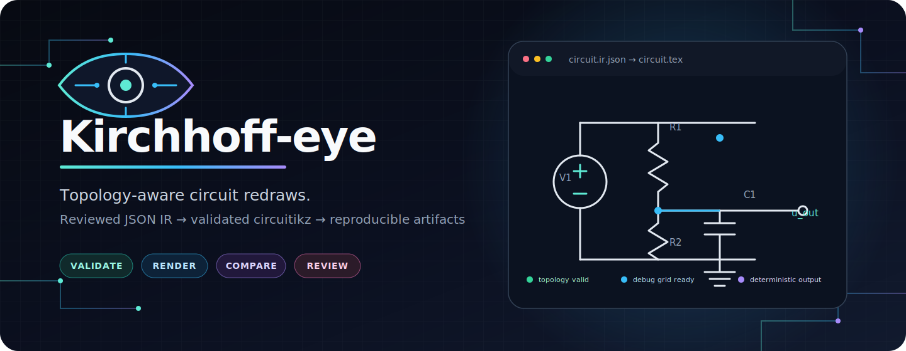
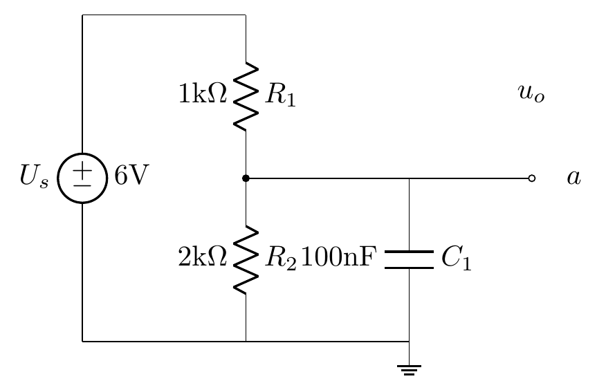
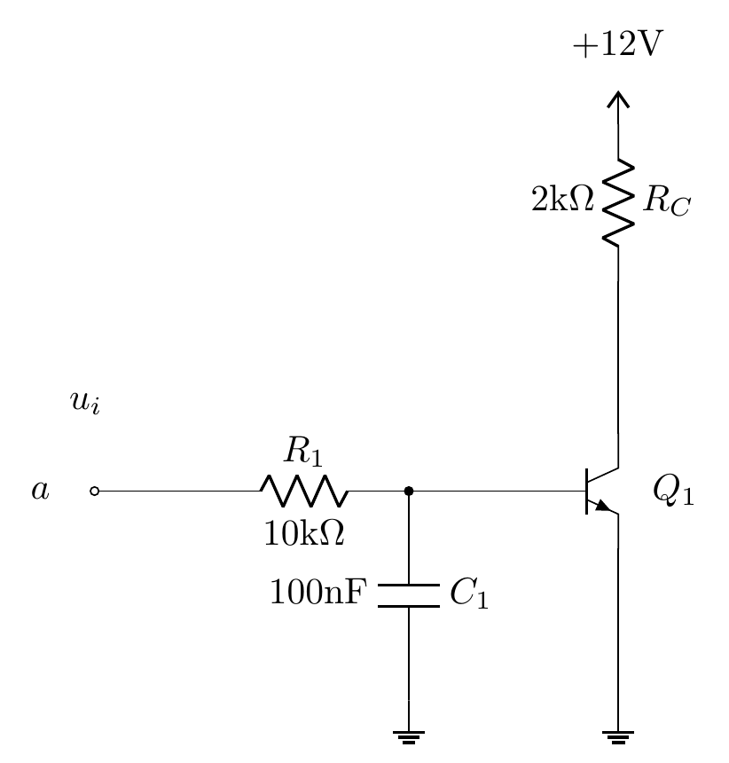

<div align="center">
  

  <br>

  [](https://github.com/Yoki-cmd/kirchhoff-eye/actions/workflows/python.yml)
  [](https://github.com/Yoki-cmd/kirchhoff-eye/actions/workflows/tex.yml)
  [](https://www.python.org/)
  [](https://github.com/circuitikz/circuitikz)
  [](LICENSE)

  **Turn a reviewed circuit model into validated, reproducible diagrams.**

  [Quick start](#quick-start) · [How it works](#how-it-works) · [IR contract](references/ir-schema.md) · [Scoring](references/semantic-redraw-scoring.md) · [Roadmap](references/perception-roadmap.md)
</div>

---

Kirchhoff-eye is an IR-driven circuit-drawing Agent Skill with a deterministic backend. Image redraw is its first mature workflow, while natural-language briefs, netlists, edit requests, review, repair, approval, and direct rendering share the same canonical JSON IR boundary.

The point is not to trace every pixel. The point is to preserve the circuit.

## Why Kirchhoff-eye

A schematic can look convincing and still be electrically wrong. One missed junction, a mirrored transistor, or a wire landing on the middle of a segment can change the circuit while barely changing the image.

Kirchhoff-eye treats the diagram as a graph with geometry:

| What matters | What the backend checks or preserves |
|---|---|
| Electrical meaning | Nets, pins, junctions, crossings, terminals, polarity |
| Recognizable composition | Relative placement, regions, buses, major routes, meaningful bends |
| Repeatability | Canonical JSON IR, schema validation, deterministic serialization |
| Reviewability | Debug grids, component anchors, IDs, layout reports, source comparisons |
| Honest uncertainty | Explicit `valid`, `needs_review`, `needs_human`, and `approved` states |

> [!IMPORTANT]
> The public v0.3 repository does not ship an autonomous arbitrary-image/prose/netlist-to-IR recognizer. Input interpretation remains an Agent/human review step. Once the IR exists, the validation, rendering, review-state, scoring, and delivery pipeline is repeatable.

## See the output

<table>
  <tr>
    <td width="50%" align="center">
      
      <br><sub><b>Golden circuit A</b> · clean circuitikz output</sub>
    </td>
    <td width="50%" align="center">
      
      <br><sub><b>Golden circuit B</b> · multi-terminal components and routed nets</sub>
    </td>
  </tr>
</table>

The repository also includes 20 public synthetic fixtures covering passive networks, sources, diodes, polarized capacitors, BJTs, MOSFETs, op-amps, transformers, SPDT switches, buses, connected junctions, unconnected crossings, current arrows, and voltage polarity.

## How it works

```text
source image
    │
    ▼
AI / human inspection
    │
    ▼
reviewed JSON IR ──► schema + topology validation
    │                           │
    │                           └──► actionable findings
    ▼
circuitikz serialization
    │
    ├──► normal render
    ├──► debug grid + component anchors
    ├──► layout report
    └──► source comparison + delivery report
```

The IR is the single source of truth. Corrections go back into JSON and the artifacts are regenerated; the workflow does not patch the final picture by hand.

## Quick start

### 1. Install

Python 3.9 or newer is required. Rendering also needs TeX Live with `circuitikz`, `pdflatex` or `lualatex`, plus `pdftoppm`.

```bash
python -m venv .venv
```

Activate the environment, then install the project:

```bash
python -m pip install -e ".[dev]"
kirchhoff-eye --help
```

### 2. Check the toolchain

```bash
kirchhoff-eye doctor
```

`doctor` checks Python, packaged schemas and templates, TeX engines, `pdftoppm`, a real `circuitikz` compile, and a writable output directory. Use `--json` in automation.

### 3. Build a reviewed IR

```bash
kirchhoff-eye build circuit.ir.json --source source.png --out out/job
```

A source-backed build opens review round 1 and produces:

```text
out/job/
├── circuit.ir.json
├── circuit.tex
├── circuit.debug.tex
├── circuit.png
├── circuit.debug.png
├── validation.json
├── layout_report.json
├── review.json
├── compare.png           # latest comparison compatibility alias
├── cmp_round1.png        # immutable round comparison
├── rounds/round-01/      # immutable round snapshot
├── FEEDBACK.md
└── DELIVERY.md
```

Exit codes describe command execution, not workflow completeness: `0=command completed and state was written`, `2=canonical/review/generation input error`, `3=environment or I/O error`. Read `review.json:status` for `valid / needs_review / needs_human / approved`.

State meaning is explicit:

- `valid`: canonical IR and deterministic artifacts are valid; no source-fidelity approval is implied;
- `needs_review`: a source comparison exists and still needs per-region review or explicit approval;
- `needs_human`: explicit blocking ambiguity (`unknowns`), convergence stop rules, or the round limit block approval; ordinary validator/layout recommendations remain diagnostics;
- `approved`: a complete, zero-difference region review was explicitly approved.

Record a complete region review, then approve it:

```bash
kirchhoff-eye review out/job round-review.json
kirchhoff-eye approve out/job --note "checked against source"
```

If differences remain, an Agent edits the canonical IR, records at most five patch operations, and opens the next round:

```bash
kirchhoff-eye repair out/job repaired.ir.json --patches patches.json
```

`config.json:max_rounds` is enforced by this production state machine. It also stops after two reviewed rounds whose difference count does not fall, or freezes an IR path after its third verified patch. Reviewed rounds are immutable. Every repair operation must cite a current `difference_id`; the backend verifies the declared IR path and operation against the actual canonical before/after change and records document SHA-256 hashes. `review.json` keeps every reviewed round and verified patch log; each round also has an immutable snapshot under `rounds/`.

## Agent task router

All supported tasks terminate at the canonical IR. The CLI does not pretend to turn arbitrary prose, netlists, or images into correct IR autonomously; an Agent authors or reviews the IR, while the deterministic backend records provenance and produces/verifies artifacts.

```bash
kirchhoff-eye task redraw-image source.png reviewed.ir.json --out out/redraw
kirchhoff-eye task draw-from-description brief.txt authored.ir.json --out out/from-brief
kirchhoff-eye task draw-from-netlist input.cir authored.ir.json --out out/from-netlist
kirchhoff-eye task edit-ir edit-request.txt edited.ir.json --out out/edit
kirchhoff-eye task render circuit.ir.json --out out/render
kirchhoff-eye task review out/redraw round-review.json
kirchhoff-eye task repair out/redraw repaired.ir.json --patches patches.json
kirchhoff-eye task approve out/redraw
```

The review and patch input contracts are machine-readable at `schemas/review.schema.json` and `schemas/patch-operations.schema.json`.

## Review without guessing

Every normal render has a matching debug render with a 0.5 grid, component IDs, and red anchor crosses. When automatic label placement is not good enough, reviewers can specify exact grid coordinates:

```json
{
  "Q1": [6.25, 5.75],
  "R2": [3.0, 7.5],
  "C1": null
}
```

Apply the positions in one deterministic step:

```bash
kirchhoff-eye labels apply circuit.ir.json positions.json -o circuit.labelled.ir.json
```

`null` keeps the current placement. Unknown component IDs, malformed coordinates, `NaN`, and infinity are rejected before an output file is written. Start from `templates/component_label_positions.json`.

## Deterministic tools

The package CLI handles the production path. The underlying scripts remain available for focused work and backwards compatibility.

| Command | Purpose |
|---|---|
| `kirchhoff-eye build IR --source IMAGE --out DIR` | Build canonical IR artifacts; with a source, open a `needs_review` round |
| `kirchhoff-eye review JOB REVIEW.json` | Record exactly one conclusion for every IR region and a structured difference table |
| `kirchhoff-eye repair JOB IR --patches PATCHES.json` | Generate the next round and persist the applied patch log |
| `kirchhoff-eye approve JOB` | Explicitly approve a clean reviewed round |
| `kirchhoff-eye task ...` | Route redraw, description, netlist, edit, review, repair, render, and approval tasks through canonical IR |
| `kirchhoff-eye labels apply IR POSITIONS -o OUTPUT` | Apply reviewed absolute label coordinates |
| `kirchhoff-eye doctor --json` | Audit the local runtime and rendering toolchain |
| `python scripts/validate_ir.py IR --phase full --json` | Validate schema, geometry, topology, and semantics |
| `python scripts/ir2tikz.py IR -o circuit.tex` | Serialize IR and create normal/debug TeX |
| `python scripts/render.py circuit.tex -o circuit.png` | Compile TeX and rasterize normal/debug PNGs |
| `python scripts/compare.py source.png circuit.png -o comparison.png` | Build side-by-side or overlay comparisons |
| `python scripts/ir_fix_and_render.py circuit.tex --layout-check --json` | Detect diagonal routes, foldbacks, pin gaps, and other layout violations |
| `python scripts/score_ir.py truth.json candidate.json --json` | Score topology, orientation, composition, annotations, and text |

## Semantic redraw, not facsimile tracing

Kirchhoff-eye accepts clean geometric changes when they do not change the diagram's logic. Uniform scale, canvas dimensions, spacing, and minor alignment may change. These are the default acceptance priorities:

1. pin connectivity and electrical topology;
2. component identity, orientation, mirror state, and polarity;
3. junction versus crossing semantics;
4. relative placement, grouping, buses, and major routes;
5. meaningful bends, annotations, and readable text.

Absolute coordinates, exact line lengths, symbol dimensions, and pixel overlap are diagnostics rather than default pass/fail criteria. The scoring contract is documented in `references/semantic-redraw-scoring.md`.

## The JSON IR

A small IR fragment looks like this:

```json
{
  "version": "kirchhoff-ir/1.0",
  "nets": [
    {"name": "VIN"},
    {"name": "VOUT"},
    {"name": "GND"}
  ],
  "components": [
    {
      "id": "R1",
      "type": "resistor",
      "from": [2, 5],
      "to": [5, 5],
      "pins": [
        {"name": "1", "net": "VIN"},
        {"name": "2", "net": "VOUT"}
      ],
      "label": "R_1",
      "value": "1\\mathrm{k}\\Omega"
    }
  ]
}
```

The full field and topology contract lives in `references/ir-schema.md`. Multi-terminal pin anchors are recorded in `templates/anchors.json`; the machine-readable schema is `schemas/ir.schema.json`.

## Quality gates

The repository runs the same public verification gates on GitHub:

- Python 3.9, 3.11, and 3.12;
- schema, CLI, packaging, scoring, rendering, and documentation tests;
- real TeX compilation and PNG rasterization;
- exact manual label-coordinate serialization;
- all 20 synthetic IR/image fixtures;
- CJK compilation through LuaLaTeX.

Run the complete suite locally:

```bash
python -m pytest tests -q
```

Regenerate and inspect the public fixtures:

```bash
python scripts/generate_synthetic_fixture.py --out tests/fixtures --dpi 72
python -m pytest tests/test_synthetic_e2e.py -q
```

## Project map

```text
kirchhoff-eye/
├── src/kirchhoff_eye/   # package CLI, doctor, labels, production pipeline
├── scripts/             # deterministic validation and rendering tools
├── schemas/             # canonical JSON schemas
├── catalog/             # supported component catalog
├── templates/           # anchors, reports, label-position templates
├── references/          # IR, style, scoring, and perception contracts
├── tests/               # unit, golden, rendering, and synthetic E2E tests
└── benchmark/           # public acceptance contract; private cases stay ignored
```

For the full operator workflow, read `SKILL.md`. For a shorter user-facing guide, read `HOWTO.md`.

## Current scope

Kirchhoff-eye targets printed or software-exported analog circuit diagrams. Hand-drawn or photographed schematics, relay/contactor control diagrams, digital logic gates, potentiometer wiper wiring, and vertical jump wires are outside the current v1 scope. Unsupported or uncertain symbols stay explicit instead of being silently replaced with the nearest known component.

Future perception work is deliberately bounded. The evidence model, supported input envelope, and `needs_human` rules are in `references/perception-roadmap.md`.

## License

MIT © 2026 [Zhanming Liang](https://github.com/Yoki-cmd). See [LICENSE](LICENSE).

<div align="center">
  <sub>Topology first. Pixels second.</sub>
</div>
